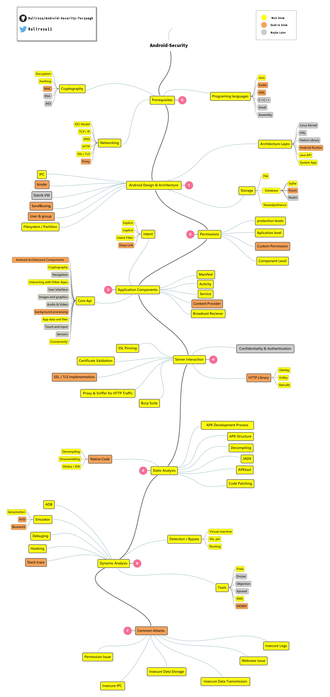

  

  
# AST - Android Security Teryaagh
  

  
Android security guides, roadmap, tools, docs, courses, write-ups and teryaagh.   
      

# Contents

0. [Roadmap](https://github.com/Ralireza/Android-Security-Teryaagh/tree/main/00-Roadmap)
    - [Programing languages](https://github.com/Ralireza/Android-Security-Teryaagh/tree/main/00-Roadmap#programing-languages)
    - [Networking](https://github.com/Ralireza/Android-Security-Teryaagh/tree/main/00-Roadmap#networking)
    - [Cryptography](https://github.com/Ralireza/Android-Security-Teryaagh/tree/main/00-Roadmap#cryptography)
    - [Android Design & Architecture](https://github.com/Ralireza/Android-Security-Teryaagh/tree/main/00-Roadmap#android-design--architecture)
    - [Permissions](https://github.com/Ralireza/Android-Security-Teryaagh/tree/main/00-Roadmap#permissions)
    - [Application Components](https://github.com/Ralireza/Android-Security-Teryaagh/tree/main/00-Roadmap#application-components)
    - [Core Api](https://github.com/Ralireza/Android-Security-Teryaagh/tree/main/00-Roadmap#core-api)
    - [Server Interaction](https://github.com/Ralireza/Android-Security-Teryaagh/tree/main/00-Roadmap#server-interaction)
    - [Static Analysis](https://github.com/Ralireza/Android-Security-Teryaagh/tree/main/00-Roadmap#static-analysis)
    - [Dynamic Analysis](https://github.com/Ralireza/Android-Security-Teryaagh/tree/main/00-Roadmap#dynamic-analysis)
    - [Common Attacks](https://github.com/Ralireza/Android-Security-Teryaagh/tree/main/00-Roadmap#common-attacks)

1. [Labs](https://github.com/Ralireza/Android-Security-Teryaagh/tree/main/01-Labs)
    - [Vulnerable APK to hack](https://github.com/Ralireza/Android-Security-Teryaagh/tree/main/01-Labs#vulnerable-apk-to-hack)
    - [Environment](https://github.com/Ralireza/Android-Security-Teryaagh/tree/main/01-Labs#environment)
3. [Writeups](https://github.com/Ralireza/Android-Security-Teryaagh/tree/main/02-Writeups)
    - [tutorial](https://github.com/Ralireza/Android-Security-Teryaagh/tree/main/02-Writeups#tutorial)
    - [CTF](https://github.com/Ralireza/Android-Security-Teryaagh/tree/main/02-Writeups#ctf)
    - [BugBounty](https://github.com/Ralireza/Android-Security-Teryaagh/tree/main/02-Writeups#bugbounty)
5. [Books](https://github.com/Ralireza/Android-Security-Teryaagh/tree/main/03-Books)
    - [Pentesting](https://github.com/Ralireza/Android-Security-Teryaagh/tree/main/03-Books#pentesting)
    - [Internals & Low-level](https://github.com/Ralireza/Android-Security-Teryaagh/tree/main/03-Books#internals--low-level)
    - [Secure coding](https://github.com/Ralireza/Android-Security-Teryaagh/tree/main/03-Books#secure-coding)
7. [Courses](https://github.com/Ralireza/Android-Security-Teryaagh/tree/main/04-Courses)
8. [Tools](https://github.com/Ralireza/Android-Security-Teryaagh/tree/main/05-Tools)
    - [Super Tools](https://github.com/Ralireza/Android-Security-Teryaagh/tree/main/05-Tools#super-tools)
    - [Static Analysis](https://github.com/Ralireza/Android-Security-Teryaagh/tree/main/05-Tools#static-analysis)
    - [APK Vulnerability Scanners](https://github.com/Ralireza/Android-Security-Teryaagh/tree/main/05-Tools#--apk-vulnerability-scanners)
    - [Dynamic Analysis](https://github.com/Ralireza/Android-Security-Teryaagh/tree/main/05-Tools#dynamic-analysis)
    - [Debuggers](https://github.com/Ralireza/Android-Security-Teryaagh/tree/main/05-Tools#--debuggers)
    - [Network Analysis](https://github.com/Ralireza/Android-Security-Teryaagh/tree/main/05-Tools#--network-analysis)
    - [Frida Powered](https://github.com/Ralireza/Android-Security-Teryaagh/tree/main/05-Tools#--frida-powered)
    - [Online](https://github.com/Ralireza/Android-Security-Teryaagh/tree/main/05-Tools#online)
    - [Secure coding & Hardening](https://github.com/Ralireza/Android-Security-Teryaagh/tree/main/05-Tools#secure-coding--hardening)
10. [Cheatsheet-Checklist](https://github.com/Ralireza/Android-Security-Teryaagh/tree/main/06-Cheatsheet%20%26%20Checklist)
11. [Talks](https://github.com/Ralireza/Android-Security-Teryaagh/tree/main/07-Talks)
12. [Misc](https://github.com/Ralireza/Android-Security-Teryaagh/tree/main/08-Misc)

# Roadmap

