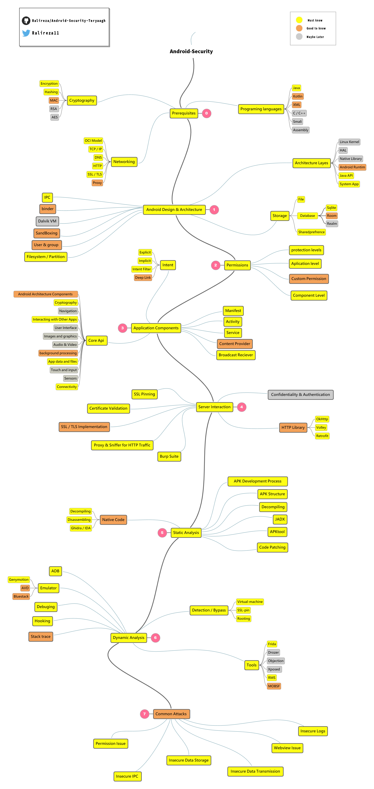

  

  
# AST - Android Security Teryaagh :fire:
  

  
Android security guides, roadmap, tools, docs, courses, write-ups and teryaagh.  

---

**📚 [Check out the full Documentation Website here!](https://ralireza.github.io/Android-Security-Teryaagh/)** (Auto-generated using MkDocs)

---

## Buy me a coffee :coffee:

USDT[ERC20] : 0x36811c0544E09b48Fe491f67C5743a43067b280B

## Contents :scroll:

0. [Roadmap](./00-Roadmap)
   - [Programing languages](./00-Roadmap#programing-languages)
   - [Networking](./00-Roadmap#networking)
   - [Cryptography](./00-Roadmap#cryptography)
   - [Android Design & Architecture](./00-Roadmap#android-design--architecture)
   - [Permissions](./00-Roadmap#permissions)
   - [Application Components](./00-Roadmap#application-components)
   - [Core Api](./00-Roadmap#core-api)
   - [Server Interaction](./00-Roadmap#server-interaction)
   - [Static Analysis](./00-Roadmap#static-analysis)
   - [Dynamic Analysis](./00-Roadmap#dynamic-analysis)
   - [Common Attacks](./00-Roadmap#common-attacks)

1. [Labs](./01-Labs)
   - [Vulnerable APK to hack](./01-Labs#vulnerable-apk-to-hack)
   - [Environment](./01-Labs#environment)

2. [Writeups](./02-Writeups)
   - [Tutorial](./02-Writeups#tutorial)
   - [Blog](./02-Writeups#blog)
   - [CTF](./02-Writeups#ctf)
   - [Bug Bounty](./02-Writeups#bugbounty)

3. [Books](./03-Books)
   - [Pentesting](./03-Books#pentesting)
   - [Internals & Low-level](./03-Books#internals--low-level)
   - [Secure coding](./03-Books#secure-coding)

4. [Courses](./04-Courses)

5. [Tools](./05-Tools)
   - [Super Tools](./05-Tools#super-tools)
   - [Static Analysis](./05-Tools#static-analysis)
   - [APK Vulnerability Scanners](./05-Tools#--apk-vulnerability-scanners)
   - [Dynamic Analysis](./05-Tools#dynamic-analysis)
   - [Debuggers](./05-Tools#--debuggers)
   - [Network Analysis](./05-Tools#--network-analysis)
   - [Frida Powered](./05-Tools#--frida-powered)
   - [Online](./05-Tools#online)
   - [Secure coding & Hardening](./05-Tools#secure-coding--hardening)

6. [Cheatsheet-Checklist](./06-Cheatsheet%20%26%20Checklist)

7. [Talks](./07-Talks)

8. [Misc](./08-Misc)

---

## Roadmap :rocket:

## Contributing

Contributions are always welcome! Please read the [contribution guidelines](CONTRIBUTING.md) first.

## Code of Conduct

Please note that this project is released with a [Contributor Code of Conduct](CODE_OF_CONDUCT.md). By participating in this project you agree to abide by its terms.
